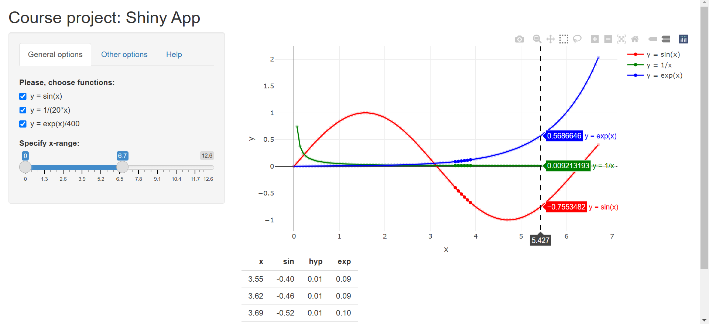

## General information

In this course project I developed Shiny app which includes the following:

-   Some forms of input: radio buttons, checkbox, slider.

-   Operations on the ui input in sever.R.

-   Reactive output displayed as a result of server calculations: interactive plotly graph, rendered table.

-   Documentation to explain new users how the app works.

## App features

The app uses the following features of Shiny and Plotly:

-   UI includes tabPanels ("General Options", "Other Options ", "Help")

-   Interactive plotly graph is implemented in the app.

-   Calculation on Server takes in consideration input from the user and which tapPanel is selected by the user at the moment.

## Some embedded R code that gets run when slidifying the document

Since the app operates with a few standard math functions and the data is generated directly in the app,  loading  and processing some data isn't necessary. Graph is drawn basing on generated data. 
Example of running embedded R code, that gets run when slidifying the document, is provided bellow (R code is too long to display on the one file of presentation, so the code is hidden on the slide and only results are displayed):

```{r include = F}
library(plotly)
```

```{r, echo=FALSE,fig.keep='all'}
x_min <- 0
x_max <- 2 * pi
step <- (x_max - x_min)/1000
x <- seq(x_min, x_max, step)
y <- sin(x^2)
df <- data.frame(x = x, y = y)
suppressWarnings(plot_ly(data = df, 
                         x = ~x, 
                         y = ~y, 
                         type = 'scatter', 
                         mode = 'lines', 
                         name = 'y = sin(x^2)',
                         width=500, 
                         height=250) %>%
        layout(hovermode = "x") %>% 
        layout(xaxis = list(spikecolor = 'rgb(0, 0, 0)', 
                            spikemode = 'across',
                            spikethickness = 1, 
                            title = 'x'),
               yaxis = list(title = 'y')
               )
        )
```

## App screenshot

{width=100%}
